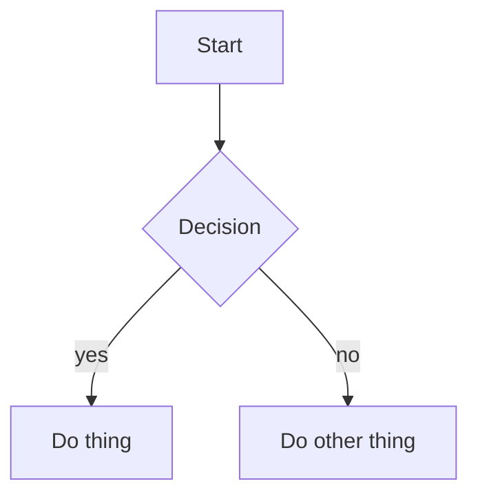

## Mermaid code blocks render as code cells instead of diagrams

I have a markdown file with a mermaid diagram embedded as a fenced code block, something like:

````md
Here's the flow:


````

When I open this file as a runme notebook I expect the mermaid block to be rendered as a diagram (the same way GitHub renders it), but instead it shows up as a regular code cell — basically as if it were a shell snippet you could run. That's not really useful for mermaid since the content is meant to be displayed, not executed.

More generally, I think it would be nice to have a way to tell runme on a per-block basis: "don't treat this fenced block as an executable cell, just keep it as markdown in the notebook." Mermaid is the obvious motivating case, but the same thing comes up for other diagram-ish or doc-only snippets where you really just want the source preserved and rendered, not turned into a runnable cell.

A couple of things I'd want from this:

1. For mermaid specifically, the sensible default should be "render as markdown / diagram," not "code cell." Most people putting ```mermaid in a doc want the picture.
2. There should still be an escape hatch on the block itself in case someone actually does want a mermaid block treated as a code cell for some reason — i.e. the per-block setting should be able to override the mermaid default in either direction.
3. For every other language, behavior should stay exactly as it is today unless the user opts in on that specific block. I don't want existing notebooks to suddenly start turning bash/python/etc. blocks into plain markdown.

Right now there doesn't seem to be any way to express this from the markdown side — every fenced block just becomes a code cell, and mermaid is no exception.

For the per-block escape hatch, something like a `transform` attribute on the fenced block (e.g. ```` ```mermaid {"transform":"true"} ```` or ```` ```javascript {"transform":"false"} ````) would be a natural fit.
